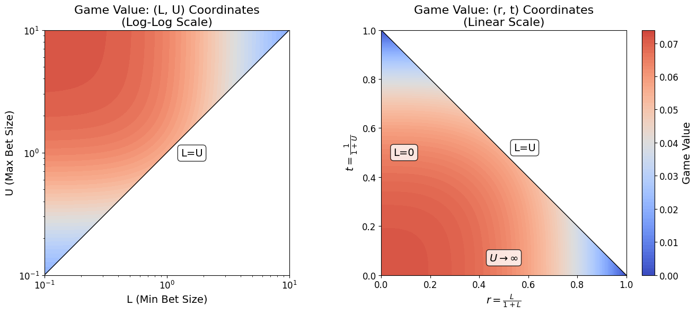
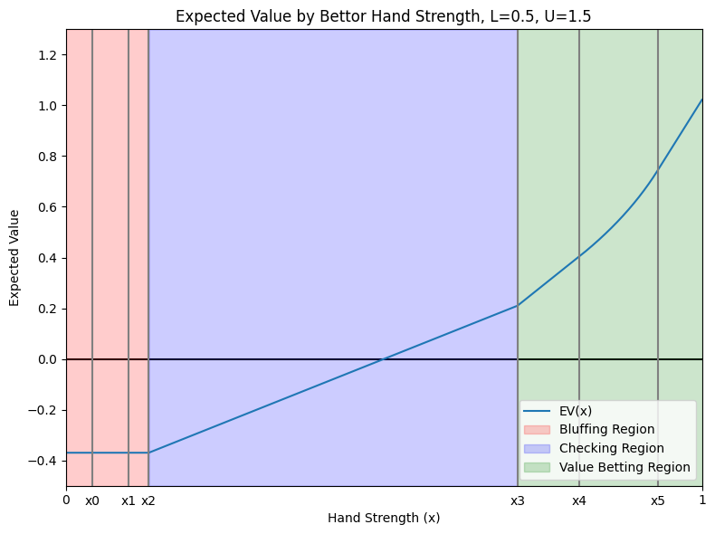

# Poker Variant Analysis

This repository contains research on **Limit Continuous Poker (LCP)**, a game-theoretic model that bridges two classical poker variants by imposing lower and upper bounds (L and U) on bet sizes. Our analysis reveals surprising mathematical structure and strategic insights about optimal betting and bluffing.

## Background: Von Neumann Poker

Von Neumann poker (also called Continous poker) is a simplified model of poker. It is a two-player zero-sum game designed to study strategic decision-making in competitive environments. The game abstracts away many complexities of real poker, focusing instead on the mathematical and strategic aspects of bluffing, betting, and optimal play.

The original game works as follows:

- The game involves only two players, often referred to as the bettor and the caller.
- Players are each dealt a real number uniformly and independently from the interval [0, 1]
- The game consists of a single 'half-street' of betting, where the bettor chooses between checking and betting a fixed amount $s$, but the caller can only call or fold (no raising, and a check by the bettor goes straight to showdown).
- In showdown, the higher hand strength wins.

Von Neumann poker has a solved Nash equilibrium strategy profile discussed here: http://datagenetics.com/blog/december32018/index.html

What if we allow the bettor to choose a bet size $s$?

A variant where $s$ can be any nonnegative real number is called No-limit Continuous Poker, discussed and solved here (page 154 of "The Mathematics of Poker" by Bill Chen and Jerrod Ankenman): https://www.pokerbooks.lt/books/en/The_Mathematics_of_Poker.pdf

### Limit Continuous Poker

We now consider the variant where $s$ is bounded by an upper limit $U$ and lower limit $L$, referred to as the max and min bets. We will call this variant Limit Continuous Poker.

To fully describe the rules:

- Two players: bettor and caller (or I and II).
- Players are each dealt a real number uniformly and independently from the interval [0, 1]
- A single 'half-street' of betting: the bettor chooses between checking and betting a fixed amount $s \in [L, U]$; if a bet is made, the caller either calls or folds.
- In showdown, the higher hand strength wins.

## Results

### Main Contributions

**1. Nash Equilibrium Strategy Profile**

We derive the unique admissible Nash equilibrium where:

- The **bettor** partitions hands into three regions: bluffing with weak hands [0, x₂], checking with medium hands [x₂, x₃], and value betting with strong hands [x₃, 1]
- Bet sizes vary continuously within bluffing and value ranges (weaker bluffs use larger bets!)
- The **caller** responds with a bet-size-dependent calling threshold that perfectly balances pot odds

**2. Closed-Form Game Value with Remarkable Symmetry**

The expected payoff for the bettor under optimal play has a surprisingly elegant formula:

$$ V(r,t) = (1 - r³ - t³) / (14 - 2r³ - 2t³) $$

where $r = L/(1+L)$ (minimum pot odds) and $t = 1/(1+U)$ (pot fraction at max bet).

**Key discovery:** The value function exhibits perfect symmetry $V(r,t) = V(t,r)$, meaning that swapping minimum and maximum bet constraints in a specific reciprocal way $(V(L,U) = V(1/U, 1/L))$ yields identical game values. This reveals a deep duality between the caller's incentive to call and the bettor's betting freedom.

**3. Counterintuitive Strategic Effects**

Increasing the maximum bet size U doesn't uniformly benefit all hands:

- **Strong hands** gain from making larger value bets
- **Intermediate hands** can actually _lose_ value because the caller becomes more conservative across all bet sizes, even though the bettor stands to gain for all hand strengths on average
- As we increase U indefinitely, each value-betting hand strength x has a critical threshold U' above which the expected value of this hand under optimal play decreases

This illustrates the complex strategic interdependencies in equilibrium play — making the game more preferable for the bettor can actually decrease their payoff in certain situations, even if it increases it in expectation

**4. Convergence to Classical Variants**

LCP smoothly interpolates between:

- **Fixed-Bet Continuous Poker (FBCP):** As $L → B$ and $U → B$, strategies converge to von Neumann's solution
- **No-Limit Continuous Poker (NLCP):** As $L → 0$ and $U → ∞$, strategies converge to the solution by Chen & Ankenman

This validates LCP as a genuine unified framework encompassing both classical models.

### Resources

- **Paper (PDF):** [latex/limit_continuous_poker/main/main.pdf](latex/limit_continuous_poker/main/main.pdf)
- **Numerical Analysis:** [notebooks/limit_continuous_poker/solve_limit_continuous.ipynb](notebooks/limit_continuous_poker/solve_limit_continuous.ipynb)
- **Interactive Widgets:**
  - [No-limit continuous poker (Desmos)](https://www.desmos.com/calculator/palhen19nj)
  - [Limit continuous poker (Desmos)](https://www.desmos.com/calculator/riicxq0xso)

---
